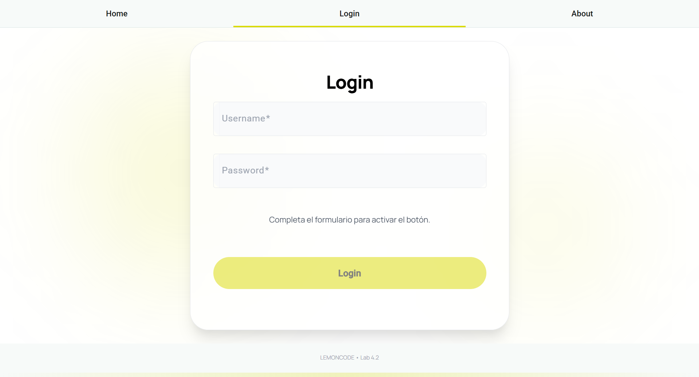
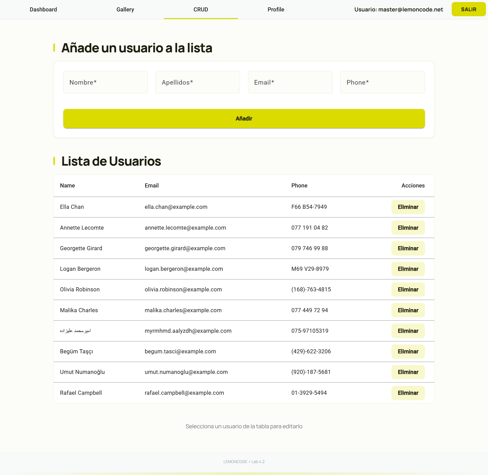
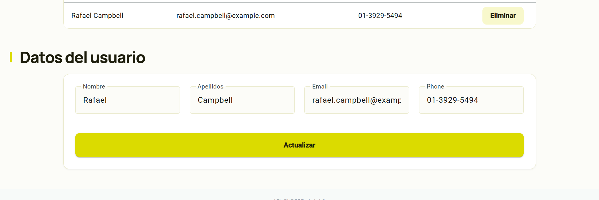

# Angular Auth & CRUD Application

Aplicación web desarrollada en Angular que implementa un sistema de autenticación con persistencia y gestión completa de usuarios mediante CRUD.

## Características principales

**Sistema de autenticación**
- Login con formulario reactivo y validaciones
- Persistencia del estado en localStorage
- Gestión de sesión mediante AuthService con signals
- Navegación dinámica entre menús público y privado
- Credenciales válidas: `master@lemoncode.net` / `12345678`

**CRUD de usuarios**
- Consumo de API REST (randomuser.me)
- Listado de usuarios con tabla de Angular Material
- Crear, editar y eliminar usuarios
- Diálogos de confirmación para operaciones críticas
- Gestión de estado reactivo con UserService

**Stack técnico**
- Angular 19 con Standalone Components
- Angular Material para la interfaz
- Reactive Forms con validaciones
- Services con signals para estado reactivo
- SCSS para estilos

## Capturas de pantalla

**Login**

**CRUD de usuarios**

**Formulario de usuario**

